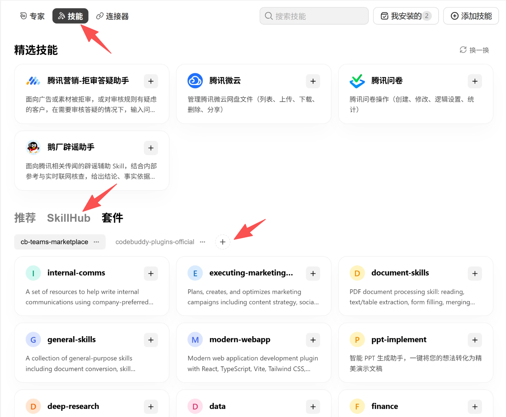

# AIhub Plugin 0.9.2

让 Codex 或 WorkBuddy 通过 AIhub 帮你生成和编辑图片、制作视频与音频、理解素材内容，或把 PDF 转成可编辑文档。适合已有 AIhub 调用账号、希望直接用对话描述任务的人。结果会保存到你指定的工作文件夹，Agent 会提供文件链接和实际检查结果。

## 能做什么

| 你要完成的事 | 对应 Skill | 可以得到的结果 |
| --- | --- | --- |
| 按描述画图，或参考已有图片进行编辑 | `aihub-image` | 图片文件 |
| 按文字、首帧图片或参考素材生成视频；用音频驱动人像或同步视频唇形 | `aihub-video` | 视频文件 |
| 把文字读成语音、把录音转成文字 | `aihub-audio` | 语音文件，或转写文本及服务返回的时间戳等信息 |
| 按描述生成音乐 | `aihub-music` | 音乐文件 |
| 提问图片、音频、视频或文件中的内容 | `aihub-understanding` | 文字回答及文本文件 |
| 将 PDF 转为 Markdown、LaTeX 或 Word（DOCX） | `aihub-document` | 包含转换结果的 ZIP 压缩包 |

目前不提供图片增强、材质贴图、人物档案创建、视频高清放大、插帧、Sora 角色创建、仅凭文字生成数字人、字幕制作或纯文本聊天入口。视频的严格首尾帧控制、保留原片的编辑与续写、精确动作控制和转场尚未验证，不能保证达到这些效果。

`aihub-audio` 还有需要明确提出、并提供参考音频的声音克隆入口，但完整交付尚未验证。服务只返回音色编号、没有预览音频时，当前程序会报告没有可下载文件；遇到这种情况，应先让 Agent 核对任务记录中的音色结果，不能直接认定克隆失败后重新提交。

你可以本次指定模型，也可以为每个 Skill 配置按顺序尝试的模型。没有模型配置时，图片常规任务使用 GPT Image 2.5 Flare；明确要求精修且速度次要时选择 Sunburst。视频按文字、明确首帧、参考素材选择对应的 Seedance 2.5 型号；人像与音频驱动、视频唇形同步使用各自的专用模型。候选必须符合输入和输出要求，切换规则见下文。Flare 与 Sunburst 的速度和细节差异尚无严格对照实测，不能保证固定提升。

## 开始前准备

- **Agent：**本版适配 Codex 与 WorkBuddy，Claude Code 适配尚未完成。
- **账号：**只需配置 `AIHUB_API_KEY`（调用服务的密钥），服务地址已有内置默认值；使用其他服务时才配置 `AIHUB_BASE_URL`。模型访问权限和额度由账号决定。
- **运行工具：**添加插件市场需要 Git；运行任务需要 Node.js 18 或更新版本，以及 FFmpeg 中用于检查媒体文件的 `ffprobe`。可以让 Agent 检查并指导安装；Plugin 本身不会自动安装系统工具或本机模型，也不需要另行启动 MCP 服务。
- **输入素材：**需要参考图、录音、视频或 PDF 时，把文件放在 Agent 能访问的位置，或提供服务能访问的链接。本地上传的单个文件须非空且不超过 20 MiB；更大的素材需要所选模型支持的远程链接。

**当前验证范围：**历史版本在 macOS 上直接运行共用程序，已完成部分图片生成、语音、转写、音乐、图片理解和 PDF 转换请求。Codex 与 WorkBuddy 从安装到 Skill 调用的完整流程尚未验收；Seedance 2.5、音画同步与数字人、Gemini 原生音乐的完整使用验证也未完成。Linux、Windows 原生环境和 WSL 的完整流程尚未验证。

## 让 Agent 帮你安装

复制下面这段话到 Codex 或 WorkBuddy：

```text
请安装 AIhub Plugin：优先用 https://github.com/cookaihq/plugin-marketplace，网络故障时改用 https://cnb.cool/zhidateam/tannt/plugin-marketplace.git。先阅读 aihub/README.md；在 WorkBuddy 中还须先读 aihub/references/workbuddy-install.md，使用当前应用的原生套件管理，不另起 CodeBuddy CLI。需要我操作界面时，请在回复中展示随包的添加市场截图，并指明“技能 → 套件 → 市场名称右侧的＋”。安装完整的 aihub@plugin-marketplace，保留已有设置，并确认 Skill 可发现和调用。
```

AIhub 通过上述 GitHub 与 CNB 来源分发。WorkBuddy 使用 **专家·技能·连接器 → 顶部“技能” → “套件” → 市场名称一行最右侧的圆形“＋”**；点击后才会出现“添加市场”窗口。下图由用户提供并确认 Windows 入口，本机 macOS 5.6.2 也已核对；入口可见不代表完整安装或 Skill 调用已验收。具体步骤见 [WorkBuddy 安装说明](references/workbuddy-install.md)。Agent 有界面操作能力时可代为完成，需要你操作时会同时展示截图和步骤。安装过程沿用 WorkBuddy 已有配置，不应为此新建 `.codebuddy`；无需手动执行终端命令。



“套件”在“SkillHub”右侧；添加市场使用市场名称右侧的“＋”。

## 完成首次配置

首次配置时，Agent 会先让你选择：使用 **secret-book** 管理凭证，或自行填写 **`.env` 文件**。已经明确选择过时会沿用。六个 Skill 默认共用一套设置，需要不同账号时再单独配置。

需要填写 `AIHUB_API_KEY`。`AIHUB_BASE_URL` 是服务的 API 根地址，未设置时为 `https://api.aihubmax.com`；不要在后面追加某个生成接口路径。使用其他地址时，先确认密钥属于该服务。

把下面的话发给 Agent：

```text
请帮我配置 AIhub，沿用已有选择，或让我选择 secret-book / 自填 .env。首次新增使用个人全局配置，已有错误则修复实际生效的原文件；选择 secret-book 时按它的流程取值保存。告诉我写入路径和实际来源，隐藏密钥，只做本机检查。
```

- **选择 secret-book：**Agent 按它的流程检查当前 Agent 规则、飞书身份和令牌表，展示实际 key、记录和目标文件供你确认，再把配置保存到 AIhub 的本机文件。首次新增默认使用 `~/.config/aihub/.env`；修复已有错误则写回实际生效的原文件。需要 secret-book 2.3.0 或更新版本，当前支持 macOS / Linux；Windows 原生环境可自行填写文件。
- **选择自行填写文件：**首次新增使用已选的**个人全局配置**，默认 `~/.config/aihub/.env`。Agent 告诉你完整路径，你在本机填写并保存。**AIhub 自动读取上述全局目录**，六个 Skill 跨项目共用；已明确只供某个项目或 Skill 使用时沿用该位置。

配置保存后，AIhub 直接读取本机文件，正常使用无需 Secret Book 查表。表中轮换密钥不会自动修改本机配置；需要更新时让 Agent 再次核对和保存。需要只在项目使用，可以让 Agent 检查项目 `.env.local` 的忽略规则与覆盖关系，再确认迁移。

两种方式都不要求你把完整密钥发到聊天。检查通过表示本机配置可读取，不表示密钥或线上服务已经验证。素材、结果和任务记录仍保存在这次任务选择的工作文件夹中。

### 配置保存在哪里，先读取哪一份？

从 secret-book 保存的配置和自行填写的配置，使用同一套文件读取顺序。修复时根据每个字段的实际来源确定原文件，不按默认保存位置另写一份；来源是进程环境变量时，先查清启动或注入位置。

下面以图片 Skill `aihub-image` 为例，越靠前越优先。视频、音频、音乐、素材理解和文档分别将文件名或子目录名中的 `aihub-image` 换成 `aihub-video`、`aihub-audio`、`aihub-music`、`aihub-understanding`、`aihub-document`；Plugin 目录始终叫 `aihub`。

| 顺序 | 位置 | 作用 |
| --- | --- | --- |
| 1 | 运行程序时的环境变量 | 当前进程已有或本次传入的设置 |
| 2 | 工作文件夹的 `.env.aihub-image` | 当前项目内仅供图片 Skill 使用 |
| 3 | 工作文件夹的 `.env.local` | 当前项目内共用 |
| 4 | 工作文件夹的 `.env` | 当前项目的补充配置 |
| 5 | `~/.config/aihub/aihub-image/.env.local` | 图片 Skill 子目录中的优先覆盖 |
| 6 | `~/.config/aihub/aihub-image/.env` | 图片 Skill 子目录中的配置 |
| 7 | `~/.config/aihub/.env.aihub-image` | 在 Plugin 根目录直接设置图片 Skill 专用配置 |
| 8 | `~/.config/aihub/.env.local` | 六个 Skill 共用的优先覆盖 |
| 9 | `~/.config/aihub/.env` | 首次新增配置的默认保存位置，六个 Skill 共用 |
| 10 | `~/.config/aihub-image/.env` | 普通图片 Skill 的配置，仅补齐前面各层缺失或为空的项 |

只需要图片 Skill 使用不同设置时，可让 Agent 协助创建 `.env.aihub-image`；需要独立子目录时再使用 `aihub-image/`。无需预先创建六个子目录或复制相同密钥。每次只读取当前 Skill 的专用文件、Plugin 共享文件和当前 Skill 的普通全局 `.env`，不读取普通 Skill 目录的 `.env.local`，也不扫描其他 Skill、旧产品别名目录或 `.env.backup` 等文件。

**密钥和服务地址分别取首个非空值。** 子目录不存在、目录为空、文件缺失或某项为空时，继续向下查找；Plugin 目录存在或已填好一项，也不阻止其他缺项读取第 10 层。文件存在但无法读取时会报错。所有来源都没有密钥就报错，没有服务地址则使用上述默认地址。两项可能来自不同文件，修改账号或地址后应检查是否匹配。

“工作文件夹”是 **Agent 实际执行任务的文件夹**，不是 Plugin 安装目录。程序不向父文件夹搜索项目配置。个人全局配置自动读取，但环境变量和当前工作文件夹中的配置仍优先；全局文件不随工作文件夹切换而改变。

| 实际运行环境 | Plugin 共用全局配置文件 | 普通 Skill 回退文件，以图片为例 |
| --- | --- | --- |
| macOS / Linux | `~/.config/aihub/.env`，`~` 表示运行程序的用户个人文件夹 | `~/.config/aihub-image/.env` |
| Windows 原生环境 | `%USERPROFILE%\.config\aihub\.env`，通常如 `C:\Users\你的用户名\.config\aihub\.env` | `%USERPROFILE%\.config\aihub-image\.env` |
| WSL（Windows 上的 Linux 环境） | WSL 用户的 `~/.config/aihub/.env`，通常如 `/home/你的Linux用户名/.config/aihub/.env` | WSL 用户的 `~/.config/aihub-image/.env` |

表中的 `aihub/` 内也可以保存 `.env.local`、当前 Skill 的专用文件及可选子目录。个人文件夹由实际运行程序的环境决定：macOS、Linux 和 WSL 优先使用 `HOME`，Windows 原生环境优先使用 `USERPROFILE`；未设置时使用系统提供的当前用户目录。WSL 不会自动读取 Windows 用户配置。可让 Agent 确认完整路径；**路径说明不代表对应平台已完成兼容性验证。**

两类全局目录默认都会读取。若某次任务只应使用环境变量和项目配置，可以说：

> 这次 AIhub 任务请关闭个人全局配置读取，同时跳过 Plugin 目录和普通 Skill 目录，只使用环境变量和当前工作文件夹中的配置，并报告实际来源。不要修改配置文件。

也可以明确要求 Agent 将新配置仅保存到项目的 `.env.local`；位于 Git 项目内时，写入密钥前须确认该文件未被跟踪且已被忽略。仅选择项目保存不会自动关闭全局读取，需要时使用上面的请求。

已有的 `~/.config/aihub-image/.env` 等当前 Skill 配置无需迁移，即可作为末层来源。同一用户下，同名 Skill 的独立安装和 Plugin 安装可能共用该文件，Plugin 中的非空值始终优先。默认保存位置仍是 `~/.config/aihub/.env`，程序不会创建、复制或搬迁已有配置。若希望主动整理这些文件，可以说：

> 请检查我以前按 Skill 保存的 AIhub 配置，隐藏密钥，列出准确的源路径和目标路径，等我确认后再迁移。相同配置可放入 AIhub Plugin 的共用文件，不同账号保留为各 Skill 的专用配置，保留已有文件，不自行覆盖。迁移是可选操作。

配置未生效时可以说：

> 请检查这次 AIhub 任务的实际工作文件夹，密钥和服务地址分别来自哪个文件或环境变量，是否被更高优先级设置覆盖。只报告来源和是否已填写，不显示密钥，也不修改文件。

## 可选：模型顺序和失败切换

只填写 Key 就能使用各任务的内置型号。需要多个候选时，在已选择的配置文件中添加相应项，例如：

```dotenv
AIHUB_IMAGE_MODELS=gpt-image-2.5-flare,gpt-image-2.5-sunburst
AIHUB_MODEL_FALLBACK_POLICY=auto
AIHUB_MODEL_MAX_ATTEMPTS=2
```

| Skill | 模型列表配置名 |
| --- | --- |
| 图片 | `AIHUB_IMAGE_MODELS` |
| 视频与数字人 | `AIHUB_VIDEO_MODELS` |
| 音频与语音 | `AIHUB_AUDIO_MODELS` |
| 音乐 | `AIHUB_MUSIC_MODELS` |
| 素材理解 | `AIHUB_UNDERSTANDING_MODELS` |
| 文档转换 | `AIHUB_DOCUMENT_MODELS` |

列表使用逗号分隔的精确型号，按顺序尝试；高优先级文件中的列表整体替换后面的列表。未配置时只选一个内置型号，不自动添加备用。本次对话明确指定型号时只用该型号，不再 fallback。

`AIHUB_MODEL_FALLBACK_POLICY` 有四种取值，均为可选：

| 值 | 行为 |
| --- | --- |
| `auto`（默认） | 在已配置且满足原要求的候选间自动尝试。 |
| `confirm` | 每次换模型前展示下一模型和参数，等你确认。 |
| `off` | 只尝试任务用途匹配的首个候选。 |
| `preflight_only` | 只允许在尚未提交生成前，跳过不可见或不兼容候选；提交后失败就停止。 |

`AIHUB_MODEL_MAX_ATTEMPTS` 可限制本次任务最多尝试几个模型，包括首选；默认最多尝试适用候选各一次。预检跳过、查询进度和下载不占次数。模型切换可能产生新的 API 费用。

配置型号后仍需已有参数转换支持：程序对每个候选分别检查，不会省略参考素材或降低指定时长、分辨率、音色等要求。例如 20 秒视频不能切换到最多支持 15 秒的型号。当前已接入的转换范围见 [模型与任务说明](references/model-selection.md#任务-json)。

自动切换只处理可确认的模型不可用或能力失败。提交结果不明、仍在运行、鉴权/额度/内容拒绝、未知服务错误、查询或下载失败都不会直接产生替换任务。内容不符合要求也不等于可以自动重做。继续任务使用已保存的列表和策略；修改配置不会改变已开始的任务。

## 默认开启的结果检查

生成完成后，Agent 会检查实际结果是否符合你的原始需求，给出“符合、不符合、证据不足或无法检查”的结论。文件能打开并不代表内容符合；视频只看过部分帧、没有检查音轨等情况会明确说明。检查失败或内容不符会保留并交付已有文件，由你决定是否修改或重做。

默认先使用当前 Agent 能用的图片、音频、视频或文档工具。缺少必要能力时通过 AIhub 检查，默认检查模型为 `gemini-3.8-flash`；会把结果、需求与必要原素材发送给 AIhub，并额外消耗额度。当前账号没有该模型或所需能力时，会报告无法检查。Jev 不属于本版依赖。

**每次完成检查后，Agent 都会提醒你可以通过对话关闭。** 可以说“仅本次关闭结果检查”“以后关闭 AIhub 的结果检查”或“恢复结果检查”。Agent 会按你明确的范围执行；范围不明时会询问。关闭后仍检查文件格式与能否解析。

以下配置均可省略：

```dotenv
AIHUB_RESULT_CHECK_ENABLED=1
AIHUB_RESULT_CHECK_PROVIDER=auto
AIHUB_RESULT_CHECK_MODELS=gemini-3.8-flash
```

开关只接受 `1` 或 `0`。provider 可为 `auto`（上述默认流程）、`host`（只用 Agent 自身能力）或 `aihub`（直接使用 AIhub）。模型可配置逗号分隔的有序列表，程序在提交前选择首个可见且能力匹配的型号；检查失败后不会自动再调用第二个型号。明确要求重新检查时才会提交新检查请求。

AIhub 检查需要上传实际产物，单个产物沿用 20 MiB 限制，超过时需宿主直接检查。文档正文提取不能证明排版、嵌入图片或公式完全保真，Agent 会说明实际检查范围。操作和限制详见 [结果检查说明](references/result-checks.md)。

## 上游连续错误时的反馈

同一任务默认累计 3 次独立上游错误时，Agent 会提供反馈入口；最终失败时即使不足 3 次也会提示。重复查询同一个失败任务不重复计数。鉴权、额度或权限问题会立即给出建议，后续成功的任务仍正常交付。

程序在任务文件夹保存公开 Issue 草稿和供服务管理员私下定位的诊断报告，不会自动发送。公开草稿排除密钥、原始任务/请求 ID、提示词和素材链接。Plugin 问题可提交 [仓库 Issue](https://github.com/cookaihq/plugin-marketplace/issues/new)，服务问题联系当前 AIhub 管理员。可选 `AIHUB_ERROR_REPORT_THRESHOLD` 修改正整数阈值，`AIHUB_SUPPORT_URL` 指定服务的支持入口。

## 第一次使用

安装和配置完成后，选择用于保存素材和结果的工作文件夹，然后继续与 Agent 对话。**下面的请求会把描述发送到 AIhub，可能消耗账号额度或产生费用，并将结果下载到本机。** 涉及参考素材的任务还会上传文件或把素材链接发送给服务，供服务处理；只提供你允许用于这次任务的内容。

```text
用 aihub-image 生成一张正方形插画：一只戴红围巾的橘猫坐在窗边，
画面简洁，不添加文字。这次做常规草稿，速度优先。
把结果保存在当前工作文件夹的 data/aihub/ 中，完成后给我图片文件链接，
并说明实际做了哪些文件和画面检查。
```

成功时会得到可打开的图片文件、完整路径、实际使用型号和检查说明。新任务默认保存在 `data/aihub/aihub-run-UUID/`，`run.json` 记录需求、候选和尝试过程；每个异步尝试在其 `attempt-N/aihub-UUID/` 下保存 `task.json` 和 `files/`。输出位置可以改成你需要的文件夹。

只有任务编号、进度或远程链接，还不算图片已交付。若仍在生成或下载失败，Agent 应保留原任务记录，说明当前状态并继续查询同一任务。交付文件时同时给出上述结果检查结论；检查尚未完成时说明进度，继续同一检查任务。

## 常用请求

下面的任务同样可能发送素材并计费。把示例中的文件名换成你自己的文件名，并告诉 Agent 文件所在位置；也可以在支持附件的对话中提供文件，再让 Agent 确认是否能够读取。

| 对 Agent 说什么 | 预期结果 |
| --- | --- |
| 用 aihub-image 编辑我提供的 product.png，把背景改成浅灰色，尽量保留产品外观；细节优先，不赶时间。 | 编辑后的图片；精确像素尺寸和遮罩外逐像素不变尚未验证 |
| 用 aihub-video 把我提供的 landscape.png 作为首帧，生成 5 秒、720p 的视频，让镜头缓慢向前移动。 | 视频文件及实际检查说明；Seedance 2.5 的真实生成效果尚未完成验证 |
| 用 aihub-audio 把“欢迎收听今天的节目”读成中文语音，使用 speech-2.8-hd，保存音频并告诉我文件位置。 | 语音文件和文件检查结果 |
| 用 aihub-audio 把我提供的 interview.mp3 转成文字，保留服务返回的时间戳，并给我结果文件。 | 转写文字和保存结构化结果的 JSON 文件；是否含时间戳以服务返回内容为准 |
| 用 aihub-music 生成一段轻快的钢琴背景音乐，使用 lyria-3-pro，保存到当前项目并给我音频链接。 | 音乐文件；可播放性检查与实际试听结果分别说明 |
| 用 aihub-understanding 描述我提供的 photo.jpg 中有哪些物体及其位置，并把回答保存为文本文件。 | 文字回答和文本文件路径 |
| 用 aihub-document 把我提供的 report.pdf 转成 Markdown，返回转换结果包；请先读取 PDF 确认页数，无法确定时再问我。 | ZIP 文档包；程序检查包的非空与 ZIP 文件签名，不保证包内文档内容完整 |

## 任务中断和结果保存

新任务先保存 `run.json`，每次异步提交另存 `task.json`，拿到任务编号后继续写入。需要继续时，把上次返回的记录路径发给 Agent：

> 用上次的 AIhub Skill 继续这个任务：〈run.json 的完整路径〉。请核对原服务和密钥，按已保存的模型列表和切换策略继续，保留已成功的文件；提交结果不明时先停止核对。

路径来自上次任务结果，不需要自己编写记录。旧 `task.json` 和只有任务编号的任务仍可查询、下载原结果，不触发新生成。按记录恢复会核对原 Skill、服务地址和密钥，密钥换过后不能直接沿用旧记录。新 `run.json` 的继续流程在确认模型失败后，可能按保存策略提交下一候选。

- **等待结束不等于生成失败。** 可以继续查询同一任务。下载或文件检查失败，也应先恢复原任务；部分成功时先取得已通过检查的文件。
- **提交结果不明时不能保证自动恢复。** 若服务尚未返回任务编号，记录只能保存这次的不确定状态，无法据此找回远端任务。先核对原请求结果，不能把重新生成当作恢复，也不能假定不会计费。
- **Gemini 原生音乐没有可查询的任务编号。** 新流程会保存 run 和返回音频，但提交结果不明时不能据此找回远端结果或自动重发；旧原生命令只保存文件，不创建任务记录。`lyria-3-pro` 则使用普通异步任务流程。
- **记录和结果由你保留。** 程序不会自动清理任务文件夹。删除记录会失去该记录提供的恢复入口；记录可能包含任务内容和素材链接，分享前请检查。文件不会写入 Plugin 安装目录。

文件交付阶段检查非空、类型及能否解析，PDF 包检查 ZIP 签名。开启结果检查后，另读实际媒体或转换正文，并按原素材核对。`review.json` 保存检查结论与证据；继续任务会复用已完成的检查。它不等于完整播放、逐帧检查或内容审核，实际覆盖范围以报告为准。

## 遇到问题时，可以这样问

| 遇到的问题 | 发给 Agent 的话 |
| --- | --- |
| 插件市场找不到 AIhub，或安装后找不到 Skill | 请先确认使用的是 GitHub 还是 CNB，核对该来源是否已发布 aihub、是否安装到当前 Agent、六个 Skill 是否完整，以及是否需要新会话；区分尚未发布或同步与本机安装问题。 |
| WorkBuddy 找不到“添加市场”按钮 | 请在回复中展示随包的添加市场截图，指明“技能 → 套件 → 市场名称右侧的＋”；“添加市场”是点击后的窗口标题。界面不同时先核对当前页面和版本。 |
| WorkBuddy 查询到空插件列表，或出现新的 `.codebuddy` 目录 | 停止另起 CodeBuddy CLI，按随包的 WorkBuddy 安装说明从原生套件管理查看市场和安装结果；保留已有目录及配置。仅补配置目录环境变量不能阻止旧版 CLI 创建诊断目录。 |
| 想用 CNB，但已添加 GitHub 的同名插件市场 | 请检查 plugin-marketplace 当前来源，说明切换到 CNB 的方式及对已安装插件的影响，保留我的插件和设置。 |
| 提示缺少 Node.js 或 ffprobe | 请检查当前运行环境中这两个工具是否能执行，并给出适合我的系统的安装或修复步骤。 |
| 缺少密钥，或修改配置后未生效 | 请报告缺失或错误字段的实际来源和依据，让我选择修改本机文件或用 secret-book 修复；已有明确选择则沿用，修复原文件并重新检查，隐藏密钥值。 |
| 密钥被拒绝或查不到模型 | 请核对密钥与服务地址的实际来源，区分认证被拒绝、网络异常、额度和权限问题。需要修复配置时让我选择手填或 secret-book，修复后先验证，不自动重发原任务。 |
| 模型列表能看到，但生成失败 | 请说明服务返回的原因和任务是否已创建；模型可见不代表当前生成通道或额度可用。 |
| 只有任务编号，或等待、下载失败 | 请用已有记录或任务编号查询同一任务，列出已完成文件和仍未完成的部分，不重新生成。 |
| 提示提交结果不明 | 请保留当前记录，说明有没有任务编号，以及还能怎样核对原请求结果；先不要再次提交。 |
| 文件已下载，但不确定结果是否正确 | 请说明已经做过哪些文件检查，再根据可用的查看或试听能力检查内容，列出无法验证的部分。 |

## 更新

AIhub 按完整 Plugin 更新，六个 Skill 会一起更新。更新通过你当前使用的 Agent 的插件管理功能进行，读取当前已配置的 GitHub 或 CNB 来源；WorkBuddy 的查询和更新继续遵循 [WorkBuddy 安装说明](references/workbuddy-install.md)，沿用同一宿主配置目录。从 CNB 安装时，需要该版本已同步到 CNB 才能取得。本 Plugin 不带独立 Skill 的自动检查更新脚本，也不读取 `AUTO_UPDATE_CHECK` 开关。是否自动更新取决于宿主提供的功能和设置。

想了解新版时可以说：

> 请通过当前 Agent 的插件管理功能检查 AIhub 的已安装版本和当前来源的可用版本，告诉我来源是 GitHub 还是 CNB，并结合更新记录说明变更内容。这次只检查。

决定更新后可以说：

> 请把完整 AIhub Plugin 更新到当前可用版本，保留我的个人全局配置、项目配置、任务记录和结果文件。完成后检查六个 Skill 能否发现和调用；如需新会话，请指导我操作。

检查更新与提交生成请求是两件事，不需要为检查更新生成图片或其他素材。版本变更见随包的 [更新记录](CHANGELOG.md)；需要进一步诊断时，可让 Agent 参考 [配置与任务恢复说明](references/cli.md)。

## 许可

MIT，见 [LICENSE](LICENSE)。
